# Evening Check-in User Flow

**Version:** 1.0
**Last updated:** 2026-03-16
**PRD sections:** 4.3, 3A.2, 7.2, 15.2-15.3
**Screen IDs:** JRE-001 through JRE-019
**Friction targets:** P0 only = ~60 sec | P0 + P1 = ~2 min | Full depth = ~3.5 min

---

## Flow Overview

The evening check-in captures the day's symptom experience, bloating/body composition data, mood, lifestyle inputs, and sleep preparation. It mirrors the morning check-in's card-based progressive disclosure pattern but contains more sections and deeper conditional branching. The Bloating & Body Composition section is the most complex card, with three independent conditional branches.

**Entry points:**
- Dashboard CTA ("Evening Check-in" card on HOM-001)
- Evening push notification (MOD-007)
- Manual navigation via bottom nav Journal tab

**Exit points:**
- Summary save (normal completion) -> Dashboard (HOM-001)
- Back/close at any point -> Save-or-discard dialog (MOD-011) -> Dashboard
- Same-as-yesterday confirm (JRE-018) -> Dashboard

---

## Mermaid Flowchart

```mermaid
flowchart TD
    START([User taps Evening Check-in]) --> HAS_HISTORY{14+ days\nof data?}

    HAS_HISTORY -- Yes --> SAY_OFFER[JRE-001: Evening Greeting\n+ Same-as-Yesterday offer]
    HAS_HISTORY -- No --> GREETING[JRE-001: Evening Greeting]

    SAY_OFFER --> SAY_CHOICE{User choice}
    SAY_CHOICE -- "Same as yesterday" --> SAY_CONFIRM[JRE-018: Quick Confirm\nEdit differences only]
    SAY_CHOICE -- "Start fresh" --> ENERGY
    SAY_CONFIRM --> SAY_EDIT{User edits?}
    SAY_EDIT -- Save as-is --> FOOD_CHECK
    SAY_EDIT -- Edit fields --> ENERGY

    GREETING --> ENERGY[JRE-002: Energy &\nCognitive Review Card]

    ENERGY --> BLOATING[JRE-003: Bloating &\nBody Composition Card]

    BLOATING --> BLOAT_CHECK{Bloating > 5?}
    BLOAT_CHECK -- Yes --> FOOD_TRIGGER[JRE-004: Bloating\nFood Triggers]
    BLOAT_CHECK -- No --> BODY_CHECK

    FOOD_TRIGGER --> STRESS_TRIGGER_CHECK{P1 enabled?}
    STRESS_TRIGGER_CHECK -- Yes --> STRESS_TRIGGER[JRE-005: Bloating\nStress Trigger]
    STRESS_TRIGGER_CHECK -- No --> BODY_CHECK

    STRESS_TRIGGER --> BODY_CHECK

    BODY_CHECK{Body feeling =\nHeavier/Swollen?}
    BODY_CHECK -- Yes --> DISTRESS[JRE-006: Body\nDistress Impact]
    BODY_CHECK -- No --> SYMPTOMS

    DISTRESS --> SYMPTOMS[JRE-007: Physical\nSymptoms Card]

    SYMPTOMS --> PALP_CHECK{Palpitations\nselected?}
    PALP_CHECK -- Yes --> PALP[JRE-008: Resting\nHR Entry]
    PALP_CHECK -- No --> HAIR_CHECK

    PALP --> HAIR_CHECK{Hair shedding\nselected?}
    HAIR_CHECK -- Yes --> HAIR[JRE-009: Hair\nShedding Severity]
    HAIR_CHECK -- No --> YEAST_CHECK

    HAIR --> YEAST_CHECK{Yeast/candida\nselected?}
    YEAST_CHECK -- Yes --> YEAST[JRE-010: Candida\nSigns Detail]
    YEAST_CHECK -- No --> SIBO_CHECK

    YEAST --> SIBO_CHECK{SIBO signs\nselected?}
    SIBO_CHECK -- Yes --> SIBO[JRE-011: SIBO\nSigns Detail]
    SIBO_CHECK -- No --> SEVERITY_CHECK

    SIBO --> SEVERITY_CHECK{P1 severity\nenabled?}
    SEVERITY_CHECK -- Yes --> SEVERITY[JRE-013: Symptom\nSeverity Sliders]
    SEVERITY_CHECK -- No --> MOOD

    SEVERITY --> MOOD

    MOOD[JRE-014: Mood &\nStress Card] --> ANXIETY_CHECK{Anxiety > 7?}
    ANXIETY_CHECK -- Yes --> ANXIETY_PHYS[JRE-012: Anxiety\nPhysical Symptoms]
    ANXIETY_CHECK -- No --> DEPTH_CHECK_LIFESTYLE

    ANXIETY_PHYS --> DEPTH_CHECK_LIFESTYLE

    DEPTH_CHECK_LIFESTYLE{P1/P2\nenabled?}
    DEPTH_CHECK_LIFESTYLE -- Yes --> LIFESTYLE[JRE-015: Lifestyle\nInputs Card]
    DEPTH_CHECK_LIFESTYLE -- No --> DEPTH_CHECK_SLEEP

    LIFESTYLE --> DEPTH_CHECK_SLEEP{P1/P2\nenabled?}
    DEPTH_CHECK_SLEEP -- Yes --> SLEEP[JRE-016: Sleep\nPreparation Card]
    DEPTH_CHECK_SLEEP -- No --> PMS_CHECK

    SLEEP --> PMS_CHECK

    PMS_CHECK{In PMS window?\ncycle tracking on +\nwithin 14 days of\npredicted period}
    PMS_CHECK -- Yes --> PMS[CYC-004: PMS\nQuick-Log Card]
    PMS_CHECK -- No --> FOOD_CHECK

    PMS --> FOOD_CHECK

    FOOD_CHECK[Food Journal\nCompletion Check]
    FOOD_CHECK --> SUMMARY[JRE-017: Evening\nSummary + Save]

    SUMMARY --> SAVE{User saves?}
    SAVE -- Save --> INSIGHT_CHECK{Contextual\ninsight available?}
    INSIGHT_CHECK -- Yes --> INSIGHT[JRE-019: Evening\nMicro-Insight]
    INSIGHT_CHECK -- No --> DASHBOARD
    INSIGHT --> DASHBOARD([HOM-001:\nDashboard])
    SAVE -- Back/Edit --> ENERGY
```

---

## Step Detail

### Step 1: Evening Greeting (JRE-001)

**Screen:** JRE-001 — Evening Check-in Entry
**Trigger:** User taps evening CTA from dashboard, notification, or journal tab.
**Content:**
- Personalized greeting: "Good evening, {displayName}" with current date
- Cycle day badge (if cycle tracking enabled): "Day {n} - {phase} phase"
- Weather note (auto-populated, passive): temperature and conditions
- Morning check-in reference: "This morning you reported energy {n}/10 and brain fog {n}/10"
- Progress stepper showing all sections in tonight's flow

**Branching:**
- If user has 14+ days of data, offer Same-as-Yesterday (JRE-018) as a prominent option alongside "Start fresh check-in"
- If first-time user (< 7 days), show brief section preview: "Tonight we'll check in on energy, symptoms, mood, and how your body felt today. Takes about 60 seconds."

**Adaptive behavior (Section 4.5):**
- Week 1: All sections visible with brief explanatory text per section
- Week 2-3: Explanatory text removed; chips reordered by frequency
- Week 3+: Rarely-used P2/P3 fields auto-collapsed; Same-as-Yesterday available

---

### Step 2: Energy & Cognitive Review Card (JRE-002)

**Screen:** JRE-002 — Card: Energy & Cognitive Review (Section A)
**Priority:** P0 (energy pattern, overall energy), P1 (brain fog trajectory, concentration), P2 (processing speed)
**Estimated time:** ~15 seconds (P0 only)

**Fields:**
1. **Energy pattern today** (P0) — QuickSelectRow, single-select: Steady, Morning crash, Afternoon crash, Multiple crashes, Steady decline, Low all day
2. **Overall energy** (P0) — SliderCard 0-10 with ghost marker from morning energy rating. Shows delta: "Morning: 5 -> Evening: 4 (-1)"
3. **Brain fog trajectory** (P1) — QuickTapSelector: Better / Same / Worse. Only shown if morning brain fog was > 0. Pre-labeled: "Brain fog was {n}/10 this morning"
4. **Concentration** (P1) — SliderCard 0-10
5. **Processing speed** (P2) — QuickTapSelector: Normal / Slow / Very slow

**Smart defaults:** Energy pattern pre-selects based on user's most common pattern after 7 days. Sliders start at user's baseline after 7 days.

**Contextual micro-insight (JRE-019, Phase 2):** If energy pattern = "Afternoon crash" for 3+ consecutive days, inline InsightCard: "Afternoon crashes 3 days running — this pattern often maps to blood sugar instability. Chapter 5 explains the insulin resistance connection."

---

### Step 3: Bloating & Body Composition Card (JRE-003)

**Screen:** JRE-003 — Card: Bloating & Body Composition (Section B)
**Priority:** P0 (bloating severity, bloating timing, body feeling), P1 (bloating location, clothes fit, water retention)
**Estimated time:** ~15 seconds (P0) + ~15 seconds for conditionals

This is the most complex card in the evening flow. It has three independent conditional branches that can each trigger additional screens.

**Fields:**
1. **Bloating today** (P0) — SliderCard 0-10 (low: "Flat/comfortable", high: "Severely distended"). Ghost marker from yesterday's bloating score.
2. **Bloating timing** (P0) — QuickSelectRow, single-select: None, Morning, After meals, Afternoon, Evening, All day
3. **Bloating location** (P1) — QuickTapSelector: Upper abdomen, Lower abdomen, Full abdomen, Not sure
4. **Body feeling today** (P0) — QuickSelectRow, single-select: Lighter than usual, About my baseline, Heavier/puffier than usual, Significantly swollen
5. **Clothes fit** (P1) — QuickTapSelector: Normal, Tighter than usual, Had to change outfit, Noticeably looser
6. **Water retention** (P1) — WaterRetentionSelector: None, Mild (fingers/ankles), Moderate (face/hands/feet), Severe (full body puffiness)

**Conditional Branch A — Bloating > 5 triggers JRE-004 and JRE-005:**

> **JRE-004: Bloating Food Triggers** (P1)
> ConditionalSection slides down. "What did you eat in the last 4 hours?"
> SymptomChipGrid multi-select: Gluten, Dairy, Cruciferous vegetables, High-FODMAP foods, Processed food, Sugar/sweets, Large meal, Carbonated drinks, Nothing unusual
> FreeTextField: "Anything else?" (optional)
> This creates the direct food-to-bloating correlation dataset for the Bloating Correlation Engine (INT-012 through INT-015).

> **JRE-005: Bloating Stress Trigger** (P1)
> ConditionalSection: "Stress level in the last few hours?"
> SliderCard 0-10 (low: "Calm", high: "Very stressed")
> Captures the stress-gut-bloating pathway.

**Conditional Branch B — Body feeling = "Heavier/puffier" OR "Significantly swollen" triggers JRE-006:**

> **JRE-006: Body Distress Impact** (P1)
> ConditionalSection: "How is this affecting your mood right now?"
> QuickTapSelector: Not bothered, Mildly frustrating, Really bothering me, Affecting my plans/confidence
> Tracks the emotional weight of weight — the distress cycle where body changes cause stress which worsens the condition.
> If "Affecting my plans/confidence" selected, soft supportive message: "Your feelings are valid. Body changes in hypothyroidism are real and measurable — this data helps you understand and explain what's happening."

**Edge case:** Both conditional branches can fire simultaneously. If bloating = 8 AND body feeling = "Significantly swollen", the user sees JRE-004, then JRE-005, then JRE-006 in sequence. The progress stepper reflects the additional sub-steps.

---

### Step 4: Physical Symptoms Card (JRE-007)

**Screen:** JRE-007 — Card: Physical Symptoms (Section C)
**Priority:** P0 (symptom chips), P1 (severity sliders, conditionals)
**Estimated time:** ~10 seconds (chip selection only)

**Fields:**
1. **Symptom chips** (P0) — SymptomChipGrid, multi-select. Default set: Hair shedding, Skin changes, Nail changes, Joint pain, Muscle pain, Heart palpitations, Constipation, Acid reflux, Nausea, Bladder urgency, Headache, Swelling/puffiness, Cold extremities, Exercise intolerance, Dizziness, Yeast/candida signs, SIBO signs
   - After 7 days, chips reorder by user's selection frequency (Section 4.5)
   - Top 2 rows visible by default; "Show more" expands full list
   - PMS symptom chips are injected into this grid during PMS window (see Step 8)
2. **New/unusual symptoms** (P2) — FreeTextField: "Anything new or unusual?" (optional)

**Conditional Branches (each triggered by selecting specific chips):**

> **If "Heart palpitations" selected -> JRE-008**
> ConditionalSection: "Resting heart rate?"
> Numeric entry field with bpm unit. Optional — can skip.

> **If "Hair shedding" selected -> JRE-009**
> ConditionalSection: "How much shedding?"
> QuickTapSelector: Normal shedding, Noticeable increase, Significant clumps, Bald patches

> **If "Yeast/candida signs" selected -> JRE-010**
> ConditionalSection: "Which signs?"
> SymptomChipGrid multi-select: Vaginal yeast infection, Oral thrush (white patches in mouth), Cracked/red corners of mouth (angular cheilitis), White-coated tongue, Mucus in stool, Skin rash/fungal patches, Nail fungus, Persistent itching

> **If "SIBO signs" selected -> JRE-011**
> ConditionalSection: "Which signs?"
> SymptomChipGrid multi-select: Excessive bloating/distension after eating, Excessive gas (belching or flatulence), Abdominal pain/cramping after meals, Diarrhea, Constipation (methane-dominant SIBO), Alternating diarrhea and constipation, Feeling full quickly/early satiety, Nausea after eating, Floating or greasy stools (fat malabsorption)

**Multiple conditionals can fire.** If user selects both "Hair shedding" and "Heart palpitations", both conditional sections appear in sequence.

> **JRE-013: Symptom Severity Sliders** (P1)
> After all conditional branches resolve, if P1 severity tracking is enabled:
> For each selected symptom chip, a SliderCard 0-10 appears in a compact stacked layout.
> "Rate severity" header with "Skip all" option to bypass the entire block.
> Each slider shows yesterday's severity as a ghost marker.

---

### Step 5: Mood & Stress Card (JRE-014)

**Screen:** JRE-014 — Card: Mood & Stress (Section D)
**Priority:** P0 (overall mood), P1 (anxiety, stress), P2 (irritability, motivation)
**Estimated time:** ~10 seconds (P0 only)

**Fields:**
1. **Overall mood** (P0) — SliderCard 0-10 + optional single-word label selector (row of emotion labels: Calm, Anxious, Irritable, Sad, Neutral, Motivated, Hopeful)
2. **Anxiety level** (P1) — SliderCard 0-10
3. **Stress level** (P1) — SliderCard 0-10
4. **Irritability** (P2) — QuickTapSelector: None, Mild, Moderate, Severe
5. **Motivation** (P2) — SliderCard 0-10

**Conditional Branch — Anxiety > 7 triggers JRE-012:**

> **JRE-012: Anxiety Physical Symptoms**
> ConditionalSection: "Physical anxiety symptoms?"
> SymptomChipGrid multi-select: Racing heart, Tension, Digestive upset, Difficulty breathing, Insomnia
> This data feeds the thyroid-anxiety correlation analysis.

---

### Step 6: Lifestyle Inputs Card (JRE-015)

**Screen:** JRE-015 — Card: Lifestyle Inputs (Section E)
**Priority:** P2 (meal composition, meal timing, exercise), P2 (stress events, fiber), P3 (xenoestrogen, liver support)
**Estimated time:** ~30 seconds if completed
**Visibility:** P1+ depth preference required. Hidden for P0-only users. Collapsed by default after Week 3 if never expanded.

**Fields:**
1. **Meal composition highlights** (P2) — SymptomChipGrid multi-select: High protein, Selenium-rich, Cruciferous vegetables, Gluten, Dairy, Processed food, Sugar/sweets, Alcohol
2. **Meal timing** (P2) — QuickSelectRow: Regular intervals, Skipped meals, Late eating, Fasting
3. **Exercise** (P2) — QuickSelectRow: None, Light, Moderate, Intense + duration picker (15/30/45/60/90 min)
4. **Stress events** (P2) — FreeTextField: "Any notable stress today?" (optional)
5. **Fiber intake** (P2) — QuickTapSelector: Low, Moderate, High
6. **Xenoestrogen exposure** (P3) — SymptomChipGrid multi-select: Plastics used, Conventional products, Non-organic produce. Hidden by default; visible via "More" section for users who enable estrogen dominance tracking.
7. **Liver support supplements** (P3) — SymptomChipGrid multi-select: DIM, Calcium-d-glucarate, Sulforaphane, None. Hidden by default; visible via "More" section.

**Note:** If the photo food journal is active with tagged meals, meal composition highlights pre-populate from today's food photos. The user can confirm or adjust.

---

### Step 7: Sleep Preparation Card (JRE-016)

**Screen:** JRE-016 — Card: Sleep Preparation (Section F)
**Priority:** P1 (sleep readiness), P2 (caffeine, screen time)
**Estimated time:** ~10 seconds
**Visibility:** P1+ depth preference. Collapsed by default for P0-only users.

**Fields:**
1. **Sleep readiness** (P1) — SliderCard 0-10 (low: "Wide awake", high: "Ready to sleep")
2. **Caffeine after 2pm** (P2) — QuickTapSelector: No, Yes + time picker
3. **Screen time before bed** (P2) — QuickTapSelector: None, <30 min, 30-60 min, >1 hour

---

### Step 8: PMS Quick-Log Card (Conditional — CYC-004)

**Screen:** CYC-004 — PMS Symptom Window Capture
**Condition:** User has cycle tracking enabled AND current date is within 14 days of predicted period start, OR user manually triggered "I think my PMS is starting."
**Priority:** P0 when active
**Estimated time:** ~20 seconds

This card is injected into the evening flow only during the PMS window. It does not appear at all for users without cycle tracking or outside the PMS window.

**Fields:**
1. **PMS symptom chips** — SymptomChipGrid multi-select: Breast tenderness, Mood crash, Anxiety spike, Irritability/rage, Depression, Crying spells, Bloating, Water retention, Headache/migraine, Food cravings, Insomnia, Acne breakout, Extra fatigue, Back pain, Digestive changes, Brain fog (worse than usual)
2. **Overall PMS severity** — SliderCard 0-10 (low: "Barely noticeable", high: "Debilitating")

**First appearance:** When the PMS card first appears in a cycle, show a brief intro: "Based on your cycle, you may be entering your PMS window. Tap any symptoms you're experiencing." User can dismiss with "Not yet" to suppress the card for 2 more days.

**Intelligence integration:** PMS chip selections + severity slider auto-feed into the PMS severity score calculation (Section 7.2). The intelligence layer tracks PMS onset day relative to predicted period for estrogen dominance trending.

---

### Step 9: Food Journal Completion Check

**Screen:** Inline prompt within JRE-017 flow (not a separate screen ID)
**Condition:** Always shown.

**Content:**
- If food photos were captured today: "You logged {n} meals today." with thumbnail strip of food photos. "Capture anything else?" button linking to PHF-001.
- If no food photos today: "Did you capture your meals today?" with CTA to open the photo food journal (PHF-001) or dismiss: "Skip for today."

This is a lightweight nudge, not a gate. Dismissing it has no penalty.

---

### Step 10: Evening Summary + Save (JRE-017)

**Screen:** JRE-017 — Evening Check-in Summary / Save
**Content:**
- Summary card showing all recorded values in a compact read-only layout, grouped by section
- Highlighted changes from this morning (deltas shown for energy, mood, any repeated metrics)
- Any values that are unusual relative to the user's baseline are flagged with a subtle highlight: "Bloating 8/10 (your average is 4.2)"
- Streak indicator: "{n}-day journaling streak" (positive framing only — Section 3A.3 Strategy 5)
- Edit buttons per section to jump back and modify

**Actions:**
- **Save** — Commits the evening entry. Triggers intelligence layer processing.
- **Back** — Returns to the last section for editing.

**Post-save behavior:**
- Haptic confirmation (light impact)
- Optional streak toast (MOD-015) if milestone reached (7 days, 30 days, etc.)
- If a contextual micro-insight is available (JRE-019), it surfaces before routing to dashboard

---

### Step 11: Route to Dashboard

**Destination:** HOM-001 (Daily Dashboard)

After save (and optional insight display), the user returns to the dashboard. The dashboard now reflects the evening check-in as complete. Trend arrows and symptom snapshots update to include today's evening data.

---

## Edge Cases & Error States

### Incomplete Check-in / Interrupted Flow
- If the user navigates away mid-check-in (app backgrounded, phone call, etc.), the in-progress entry is auto-saved as a draft.
- On return, prompt: "Continue your evening check-in?" with option to resume from where they left off or start over.
- Drafts expire after 4 hours (an evening check-in started at 6pm but not finished by 10pm is discarded).

### Duplicate Check-in Attempt
- If the user already completed an evening check-in today, tapping the CTA shows: "You already checked in tonight. Edit your entry?" Routes to JRE-017 in edit mode.

### Missing Morning Check-in
- The evening flow works independently. If no morning check-in exists for today:
  - Brain fog trajectory question (JRE-002) is hidden (no morning reference)
  - Energy delta display is hidden (no morning baseline)
  - Greeting omits morning reference

### No Cycle Tracking
- PMS card (Step 8) never appears.
- Cycle day badge is hidden.
- No changes to any other step.

### New User (Days 1-7)
- All P0 fields visible with brief contextual labels explaining each one
- P1 fields visible but marked as optional with "helps us detect patterns" micro-copy
- P2/P3 fields collapsed under "More" expander
- No Same-as-Yesterday option
- No smart defaults (not enough data)
- No ghost markers on sliders

### Experienced User (14+ Days)
- Same-as-Yesterday offered prominently (JRE-018)
- Smart defaults pre-fill all sliders
- Ghost markers on all sliders
- Rarely-used sections auto-collapsed
- Symptom chips reordered by frequency

### Network Failure
- Check-in data is stored locally first, synced when connectivity returns
- Save button works offline; shows "Saved locally, will sync when online" toast
- NAV-006 error state only appears if the app cannot even load the check-in form

---

## Timing Budget Breakdown

| Section | P0 Time | P0+P1 Time | Full Depth |
|---------|---------|------------|------------|
| Greeting (JRE-001) | 3 sec | 3 sec | 3 sec |
| Energy & Cognitive (JRE-002) | 10 sec | 20 sec | 25 sec |
| Bloating & Body (JRE-003) | 15 sec | 25 sec | 25 sec |
| Bloating conditionals (JRE-004/005/006) | 0 sec* | 15 sec* | 15 sec* |
| Physical Symptoms (JRE-007) | 10 sec | 15 sec | 20 sec |
| Symptom conditionals (JRE-008-013) | 0 sec* | 15 sec* | 20 sec* |
| Mood & Stress (JRE-014) | 8 sec | 20 sec | 30 sec |
| Anxiety conditional (JRE-012) | 0 sec* | 5 sec* | 5 sec* |
| Lifestyle Inputs (JRE-015) | 0 sec | 0 sec | 30 sec |
| Sleep Prep (JRE-016) | 0 sec | 10 sec | 15 sec |
| PMS Quick-Log (CYC-004) | 0 sec** | 0 sec** | 20 sec** |
| Food check + Summary (JRE-017) | 8 sec | 10 sec | 12 sec |
| **Total** | **~54 sec** | **~2 min 18 sec*** | **~3 min 40 sec*** |

\* Conditional time only applies when triggered. Worst-case (all conditionals fire) adds ~35 sec.
\** PMS card only present during PMS window (~7-14 days per cycle).

---

*End of Evening Check-in Flow v1.0*
