# Morning Check-in Flow

**Version:** 1.0
**Date:** March 16, 2026
**Source:** ignitehealth-prd.md v1.0, Sections 4.2, 3A.2, 4.5, 7.1, 15.1
**Screen IDs:** JRM-001 through JRM-013
**Friction targets:** P0 only = ~45 sec | P0 + P1 = ~90 sec | Full depth = ~2.5 min

---

## 1. Flow Diagram

```mermaid
flowchart TD
    START([User taps Morning Check-in CTA on HOM-001]) --> GREETING[JRM-001: Morning Greeting]

    GREETING --> HAS_14_DAYS{14+ days of data?}
    HAS_14_DAYS -- Yes --> SAY_OFFER[Offer Same-as-Yesterday]
    HAS_14_DAYS -- No --> SLEEP_CARD

    SAY_OFFER --> SAY_CHOICE{User choice}
    SAY_CHOICE -- "Confirm all" --> SAY_CONFIRM[JRM-012: Same-as-Yesterday Quick Confirm]
    SAY_CONFIRM --> EDIT_DIFFS{User edits diffs?}
    EDIT_DIFFS -- No edits --> SUMMARY
    EDIT_DIFFS -- Taps a field --> JUMP_TO_CARD[Jump to relevant card in edit mode]
    JUMP_TO_CARD --> SUMMARY

    SAY_CHOICE -- "Full entry" --> SLEEP_CARD

    SLEEP_CARD[JRM-002: Sleep Card]
    SLEEP_CARD --> SLEEP_QUALITY_CHECK{Sleep quality < 5?}
    SLEEP_QUALITY_CHECK -- Yes --> SLEEP_DISRUPTION[JRM-003: Sleep Disruption Reasons]
    SLEEP_DISRUPTION --> BODY_CARD
    SLEEP_QUALITY_CHECK -- No --> BODY_CARD

    BODY_CARD[JRM-004: Body State Card]
    BODY_CARD --> ENERGY_CHECK{Energy < 4?}
    ENERGY_CHECK -- Yes --> EXERCISE_TOL[JRM-006: Exercise Tolerance Yesterday]
    ENERGY_CHECK -- No --> FOG_CHECK

    EXERCISE_TOL --> FOG_CHECK{Brain fog > 6?}
    FOG_CHECK -- Yes --> WORD_RETRIEVAL[JRM-007: Word Retrieval Difficulty]
    FOG_CHECK -- No --> PAIN_CHECK

    WORD_RETRIEVAL --> PAIN_CHECK{Pain present?}
    PAIN_CHECK -- Yes, Mild/Moderate/Severe --> PAIN_MAP[JRM-005: Pain Location Body Map]
    PAIN_CHECK -- None --> PERIOD_CHECK

    PAIN_MAP --> PERIOD_CHECK

    PERIOD_CHECK{Active period day?}
    PERIOD_CHECK -- Yes --> PERIOD_QUICK[Period Quick-Log: Flow + Clots + Cramps]
    PERIOD_CHECK -- No --> MICRO_INSIGHT_CHECK
    PERIOD_QUICK --> MICRO_INSIGHT_CHECK

    MICRO_INSIGHT_CHECK{Contextual insight available?}
    MICRO_INSIGHT_CHECK -- Yes --> MICRO_INSIGHT[JRM-013: Inline Micro-Insight]
    MICRO_INSIGHT_CHECK -- No --> MED_CARD
    MICRO_INSIGHT --> MED_CARD

    MED_CARD[JRM-008: Medication & Supplements Card]
    MED_CARD --> CONTEXT_CARD

    CONTEXT_CARD[JRM-009: Quick Context Card]
    CONTEXT_CARD --> PHOTO_PROMPT

    PHOTO_PROMPT[JRM-010: Visual Health Photo Prompt]
    PHOTO_PROMPT --> PHOTO_CHOICE{User choice}
    PHOTO_CHOICE -- "Take photos" --> VHP_FLOW[VHP-001+: Photo Capture Flow]
    PHOTO_CHOICE -- "Skip" --> SUMMARY
    VHP_FLOW --> SUMMARY

    SUMMARY[JRM-011: Morning Summary / Save]
    SUMMARY --> SAVE_ACTION{User taps Save}
    SAVE_ACTION --> INSIGHT_DISPLAY{Insight generated?}
    INSIGHT_DISPLAY -- Yes --> SHOW_INSIGHT[Post-save Micro-Insight Card]
    INSIGHT_DISPLAY -- No --> DASHBOARD
    SHOW_INSIGHT --> DASHBOARD([Route to HOM-001 Dashboard])

    %% Edge cases
    GREETING --> SKIP_ALL{User taps X / Back from greeting}
    SKIP_ALL --> DISCARD_CONFIRM[MOD-011: Save/Discard Dialog]
    DISCARD_CONFIRM -- Discard --> DASHBOARD
    DISCARD_CONFIRM -- Keep editing --> GREETING

    style START fill:#E8F5F1,stroke:#2E7D6F
    style DASHBOARD fill:#E8F5F1,stroke:#2E7D6F
    style SAY_CONFIRM fill:#FFF3D6,stroke:#E9A820
    style SLEEP_DISRUPTION fill:#FDEAE4,stroke:#C75B39
    style EXERCISE_TOL fill:#FDEAE4,stroke:#C75B39
    style WORD_RETRIEVAL fill:#FDEAE4,stroke:#C75B39
    style PAIN_MAP fill:#FDEAE4,stroke:#C75B39
    style PERIOD_QUICK fill:#FDEAE4,stroke:#C75B39
    style MICRO_INSIGHT fill:#FFF3D6,stroke:#E9A820
    style SHOW_INSIGHT fill:#FFF3D6,stroke:#E9A820
```



**Legend:**
- Green nodes: entry/exit points
- Yellow nodes: adaptive/intelligence features
- Red-tinted nodes: conditional branches (only appear when triggered)

---

## 2. Step-by-Step Detail

### Step 1 — Morning Greeting (JRM-001)

**Screen:** Full-width greeting card at the top of the check-in view.

**Content:**
- Personalized greeting: "Good morning, {displayName}" (uses anonymized display name from onboarding)
- Date: "March 16 -- Wednesday"
- Cycle day badge (if cycle tracking enabled): "Day 22 -- Luteal phase" using `CycleDayBadge` component with phase-specific color
- ProgressStepper showing all sections in the flow (Sleep > Body > Meds > Context > Photo > Save)
- If 14+ days of data exist, a prominent "Same as yesterday?" button appears below the greeting

**Duration:** ~3 seconds (read + decide)

**Progressive disclosure:**
- Week 1: Greeting + date only
- Week 2+: Cycle day added if tracking
- Day 14+: Same-as-Yesterday option appears

---

### Step 2 — Same-as-Yesterday Quick Confirm (JRM-012)

**Trigger:** User has 14+ days of baseline data AND taps "Same as yesterday?"

**Content:**
- Summary card showing yesterday's values in a compact layout:
  - Sleep: "7h, quality 6/10, refreshed 5/10, 1 waking"
  - Body: "Energy 5, fog 3, no pain, slightly cold, mood: Neutral"
  - Meds: "Levo 75mcg at 6:30 AM, empty stomach. Vit D, Selenium."
- Each row is tappable to jump to that card for editing
- "Confirm -- same today" primary button
- "Full entry instead" text link

**Duration:** ~15-20 seconds for confirm-and-edit workflow

**Logic:**
- On confirm, all yesterday's values are copied to today's entry
- User can tap any row to jump directly to that card in edit mode, with yesterday's values pre-filled
- After editing, user returns to summary to save

---

### Step 3 — Sleep Card (JRM-002)

**Section:** "How You Slept"
**Priority fields shown by engagement phase:**

| Field | Priority | Week 1 | Week 2-3 | Month 2+ |
|-------|----------|--------|----------|----------|
| Sleep quality (0-10) | P0 | Shown | Shown | Shown |
| Waking refreshed (0-10) | P0 | Shown | Shown | Shown |
| Sleep duration | P1 | Hidden | Shown | Shown |
| Night wakings (0-4+) | P1 | Hidden | Shown | Shown |
| Waking basal body temperature | P2 | Hidden | Hidden | Shown |

**Smart defaults (after 7 days):** Slider starts at user's baseline average. Ghost marker shows yesterday's value.

**Conditional trigger:** If sleep quality < 5, the ConditionalSection slides open with JRM-003 (sleep disruption reasons).

**Duration:** ~10 seconds (P0) | ~15 seconds (P0+P1) | ~25 seconds (full)

---

### Step 3a — Sleep Disruption Reasons (JRM-003)

**Trigger:** Sleep quality slider set below 5.

**Content:** Multi-select SymptomChipGrid: Pain, Temperature dysregulation, Racing thoughts, Bathroom, Night sweats, Unknown.

**Behavior:**
- Slides open with 250ms animation (instant if reduced motion)
- Chips reorder by frequency after 7 days of data
- If user moves quality slider back to 5+, section collapses but retains state (`maintainState: true`)

**Duration:** ~5 seconds

---

### Step 4 — Body State Card (JRM-004)

**Section:** "Body State"
**Priority fields shown by engagement phase:**

| Field | Priority | Week 1 | Week 2-3 | Month 2+ |
|-------|----------|--------|----------|----------|
| Energy level (0-10) | P0 | Shown | Shown | Shown |
| Brain fog severity (0-10) | P0 | Shown | Shown | Shown |
| Predominant mood (single-select) | P0 | Shown | Shown | Shown |
| Pain/stiffness (4-level) | P1 | Hidden | Shown | Shown |
| Cold intolerance (4-level) | P1 | Hidden | Shown | Shown |

**Conditional triggers (evaluated in real time as user adjusts sliders):**
- Energy < 4 --> reveals JRM-006 (exercise tolerance)
- Brain fog > 6 --> reveals JRM-007 (word retrieval difficulty)
- Pain = Mild/Moderate/Severe --> reveals JRM-005 (pain body map)

**Micro-insight injection (JRM-013):** If the intelligence layer has a contextual insight (e.g., brain fog elevated for 4+ consecutive days, or correlation with luteal phase), an InsightCard appears inline between the body state fields and the conditional sections. Phase 2 feature.

**Duration:** ~12 seconds (P0) | ~20 seconds (P0+P1) | ~30 seconds (with conditionals)

---

### Step 4a — Pain Location Body Map (JRM-005)

**Trigger:** Pain/stiffness = Mild, Moderate, or Severe.
**Priority:** P1 (Week 2+). In Week 1, pain presence is captured but body map is deferred.

**Content:** Tappable body outline (front view) with selectable regions: Head/Neck, Shoulders, Upper back, Lower back, Hands/Wrists, Hips, Knees, Feet/Ankles, Full body.

**Duration:** ~8 seconds

---

### Step 4b — Exercise Tolerance Yesterday (JRM-006)

**Trigger:** Energy < 4.
**Priority:** P2 (Month 2+).

**Content:** QuickTapSelector: "How did exercise feel yesterday?" -- options: Didn't exercise, Normal tolerance, Reduced tolerance, Exercise intolerant, Made symptoms worse.

**Duration:** ~5 seconds

---

### Step 4c — Word Retrieval Difficulty (JRM-007)

**Trigger:** Brain fog > 6.
**Priority:** P1 (Week 2+).

**Content:** QuickTapSelector: "Word retrieval difficulty?" -- Yes / No.

If Yes, optional follow-up: "Describe it" FreeTextField (200 char).

**Duration:** ~3 seconds (No) | ~10 seconds (Yes + note)

---

### Step 4d — Period Quick-Log (inline, during active period)

**Trigger:** User is in an active period (confirmed via CYC-002 or predicted from cycle history). Added to the Body State card as a distinct sub-section.
**Source:** PRD Section 7.1

**Content:** Three QuickTapSelectors stacked:
1. Flow heaviness: Spotting / Light / Moderate / Heavy / Flooding
2. Clots: None / Small (dime or less) / Large (quarter+)
3. Cramps: None / Mild / Moderate / Severe / Debilitating

"Period ended" one-tap button appears after Day 3.

**Alerts triggered by data:**
- Clots = "Large (quarter+)" --> educational notification about estrogen dominance (surfaces post-save, not inline)
- Cramps = "Severe" or "Debilitating" for 2+ cycles --> endometriosis/fibroid educational alert (surfaces in INT feed)

**Duration:** ~15 seconds (3 quick-taps)

---

### Step 5 — Medication & Supplements Card (JRM-008)

**Section:** "Meds & Supplements"
**Always shown (P0 for thyroid med, P1/P2 for supplements).**

**Content:**
- Primary medication (from user profile): MedicationCard component
  - Quick-tap: Yes / Not yet / Skipped
  - If Yes: auto-timestamp (editable) + "Taken with" multi-select: Empty stomach, Coffee, Food, Calcium, Iron, Other supplements
  - Absorption interference AlertBanner (MED-010) if taken with calcium, iron, coffee, or food within 30 min window
- Supplement checklist (P2, Month 2+): personalized list from onboarding, each with checkbox
  - Collapsed by default after first week if user consistently takes the same set (one-tap "All taken" option)

**Duration:** ~8 seconds (med only) | ~15 seconds (med + supplements)

---

### Step 6 — Quick Context Card (JRM-009)

**Section:** "Quick Context"
**Priority:** P1 (Week 2+). Entire card hidden in Week 1.

**Content:**
- Hunger/appetite slider (0-10, P2)
- Hydration slider (0-10, P2)
- Notes FreeTextField (200 char, P2): "Anything notable this morning?"

**Duration:** ~10 seconds (if used) | 0 seconds (skipped in Week 1)

---

### Step 7 — Visual Health Photo Prompt (JRM-010)

**Section:** "Daily Photo"
**Priority:** P1. Shown from Week 2 onward. Always skippable.

**Content:**
- Prompt text: "Capture your morning photo for your visual timeline"
- Guidance: "Same lighting and angle each day gives the best comparisons"
- "Take photo" button --> launches VHP-001 (face front guided capture)
- "Skip today" text link
- If baseline period (first 7 days of photos): VHP-012 baseline indicator overlay
- After face front, optional prompts for profile, hair, hands/nails (progressive -- app introduces one new photo type per week)

**Duration:** ~30-60 seconds (if taking photos) | ~3 seconds (skip)

---

### Step 8 — Morning Summary / Save (JRM-011)

**Section:** Summary view showing all captured data in a compact read-only layout.

**Content:**
- Grouped summary of each section with key values
- Any section with missing data shows a subtle "incomplete" indicator (not shaming -- just factual)
- Tappable sections to jump back and edit
- Estimated check-in duration shown: "This took ~{time}"
- Primary button: "Save Morning Check-in"
- Streak indicator (if applicable): "Day 12 streak" (P2, uses MOD-015 toast on save)

**Behavior on save:**
- Data persisted to local storage immediately, synced to cloud in background
- Weather data auto-attached from API (PRD Section 4.6)
- Cycle day auto-tagged if cycle tracking enabled
- Intelligence layer triggered for pattern analysis (async)

**Duration:** ~5 seconds (review + tap save)

---

### Step 9 — Post-Save Micro-Insight

**Trigger:** Intelligence layer has generated an insight based on this check-in's data combined with historical patterns. Phase 2 feature.

**Content:** InsightCard displayed as a bottom sheet or inline card after save confirmation:
- Example: "Your brain fog has been above 6 for 4 consecutive days. This coincides with your luteal phase. Chapter 7 explains the estrogen-progesterone connection."
- "Learn more" link to book chapter or intelligence detail screen
- "Dismiss" to proceed to dashboard

**Duration:** ~5 seconds (read + dismiss)

---

### Step 10 — Route to Dashboard

After save (and optional insight dismissal), the user returns to HOM-001 (Daily Dashboard). The dashboard reflects the just-saved data immediately.

---

## 3. Progressive Disclosure Schedule

| Time Period | Sections Shown | Fields Visible | Target Duration |
|-------------|---------------|----------------|-----------------|
| Week 1 (Days 1-7) | Sleep (P0), Body (P0), Meds (P0), Save | Sleep quality, refreshed, energy, brain fog, mood, thyroid med taken | ~45 seconds |
| Weeks 2-3 (Days 8-21) | + Sleep (P1), Body (P1), Context (P1), Photo (P1) | + Duration, wakings, pain, cold intolerance, photo prompt | ~90 seconds |
| Month 2+ (Day 30+) | + Sleep (P2), Body (P2), Context (P2), Meds (P2) | + BBT, exercise tolerance, hunger, hydration, notes, full supplements | ~2.5 minutes |
| Day 14+ | Same-as-Yesterday available | All applicable fields pre-filled from yesterday | ~15-20 seconds |

---

## 4. Edge Cases

### 4.1 User Skips Check-in Entirely
- Morning reminder notification (MOD-006) fires at user's configured time
- If dismissed or ignored, no further nagging
- Dashboard shows a subtle "No morning check-in today" note (not shaming)
- Intelligence layer widens confidence intervals for that day's missing data
- If skipped 3+ days in a row, a gentle re-engagement prompt appears on dashboard: "Your pattern data works best with consistent entries. Pick up where you left off?"

### 4.2 Partial Completion
- Data is auto-saved locally as the user progresses through cards
- If the user leaves mid-flow (app backgrounded, notification tap, etc.), the partial entry is preserved
- On return, the app offers: "You have an unfinished morning check-in. Continue where you left off?"
- Partial data IS saved to the database on a 5-minute timeout -- labeled as partial so the intelligence layer knows
- ProgressStepper shows which sections are complete vs. incomplete

### 4.3 Back Navigation
- User can tap any completed step in the ProgressStepper to jump back
- Back button/swipe on any card returns to the previous card
- Edited values are preserved when navigating back and forward
- From the summary screen, tapping any section jumps to that card for editing, then returns to summary

### 4.4 Same-as-Yesterday Edge Cases
- If yesterday's entry was partial, Same-as-Yesterday only pre-fills the fields that were completed
- If yesterday's entry had conditional branches (e.g., sleep quality was 3, triggering disruption reasons), the conditional data is also pre-filled and the conditional section is shown
- If user was on their period yesterday but not today (period ended), the period quick-log fields are removed from the pre-fill
- If a medication was changed since yesterday (new med, dose change), the medication card is NOT pre-filled -- user must re-confirm

### 4.5 First-Ever Check-in
- No ghost markers on sliders (no previous data)
- Brief tooltip on first slider: "Slide to rate. 0 is none, 10 is severe."
- No Same-as-Yesterday option
- Greeting includes a welcome message: "Your first check-in! This takes about 45 seconds."
- Only P0 fields shown regardless of the date (progressive disclosure starts from Day 1 of use, not calendar date)

### 4.6 Multiple Check-ins Same Day
- If user already completed a morning check-in today and taps the CTA again, the app opens the existing entry in edit mode
- No duplicate entries -- edits overwrite the original with a version history
- "Last saved at {time}" indicator shown

### 4.7 Late Check-in
- If completing the morning check-in after 2 PM, a gentle note: "Logging for this morning? Your answers should reflect how you felt when you woke up."
- Timestamp is recorded as actual entry time, but a "refers to" field marks it as morning data

### 4.8 Offline Mode
- Full check-in flow works offline using local storage
- Data syncs when connectivity returns
- No features are degraded -- all fields, conditionals, and Same-as-Yesterday work offline
- Photo capture works offline; photos sync later

---

## 5. Conditional Branch Summary

| Trigger | Threshold | Reveals | Screen ID | Priority |
|---------|-----------|---------|-----------|----------|
| Sleep quality | < 5 | Sleep disruption multi-select | JRM-003 | P0 |
| Energy level | < 4 | Exercise tolerance yesterday | JRM-006 | P2 |
| Brain fog | > 6 | Word retrieval difficulty | JRM-007 | P1 |
| Pain/stiffness | Mild, Moderate, or Severe | Pain location body map | JRM-005 | P1 |
| Active period | Cycle tracking ON + in active period | Flow + clots + cramps quick-log | Inline on JRM-004 | P0 (cycle) |
| Thyroid med taken | Yes | Timing + taken-with fields | Expand on JRM-008 | P1 |
| Taken with calcium/iron/coffee/food | Selected | Absorption interference warning | AlertBanner on JRM-008 | P1 |
| Intelligence pattern detected | Async, post body state | Contextual micro-insight | JRM-013 | P1 (Phase 2) |

---

## 6. Data Flow

```
Morning Check-in Entry
    |
    v
Local Storage (immediate, per-card auto-save)
    |
    v
On Save: write to Supabase (journal_entries table)
    |
    +---> Attach weather metadata (async, from weather API)
    +---> Attach cycle day + phase (if tracking)
    +---> Tag with engagement_week for progressive disclosure state
    |
    v
Pub/Sub event: morning_checkin_saved
    |
    +---> Pattern Analysis Agent (async)
    +---> Medication Timing Correlation (async)
    +---> Vicious Cycle Detection (async, if sufficient data)
    +---> Visual Health Photo linkage (if photos taken)
```

---

*End of Morning Check-in Flow v1.0*
